# whale-engine


<p align="left">
  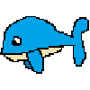
  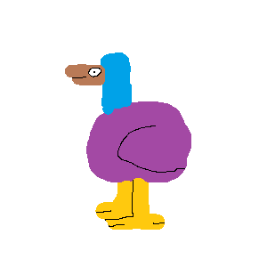
</p>

Whale Engine is a game engine for Python.

# developed by dodo (D0d0ka)

## Documentation

Full documentation is available in [`documentation.md`](documentation.md).
For practical examples look at the `examples/` folder.

## Quick start

```python
from WhaleEngine import *
from WhaleEngine.WindowAPI.OpenGL import windowAPI # from WhaleEngine.WindowAPI.Vulkan import windowAPI # from WhaleEngine.WindowAPI.WebGL import windowAPI

window = windowAPI(title="Whale engine app") # create a window using the OpenGL API, you can also use Vulkan or WebGL by changing the import above and uncommenting the line below
app = WhaleEngine(window=window) # create app with the window we just made
renderer = Renderer2D() # create a 2D renderer
app.input = InputSystem() # loads input system so you can use app.input instead of app.InputSystem
textures = LoadTextures() # load built textures

window.set_color(Color.cyan) # set window background color to cyan

entity = Entity2D(texture=textures.whale) # create an entity with the whale texture

def update(dt):
    if app.input.key(Keys.SPACE): # check if space is being pressed
        entity.rotation += 90 * dt # rotate entity 90 degrees per second
        entity.x -= 100 * dt # move entity 100 pixels to the right per second
app.update = update # set the app's update function

def on_app_close():
    logLn("Closing", "app") # logs this: <app> Closing
app.on_app_close = on_app_close # set the app's on_app_close function

app.run() # run the app
```
> Another one but without comments: [`AppBase.py`](AppBase.py)

## How it works

- Create a `windowAPI` and pass it to `WhaleEngine`.
- Add plugins you need (`InputSystem`, `MouseSystem`, `SoundSystem`, etc.) — only init what your game uses.
- Create a `Renderer2D` to draw things on screen.
- Place `Entity2D` objects into the scene with a texture, position and scale.
- Define an `update(dt)` function and assign it to `app.update` — it is called every frame.
- Call `app.run()` to start the main loop.

World coordinates are centered: `(0, 0)` is the screen center, `+x` right, `+y` up.

## Rendering backends

Choose the graphics API that fits your needs:

| Backend | Notes                              |
|---------|------------------------------------|
| OpenGL  | Most stable                        |
| Vulkan  | Experimental (probably won't work) |
| WebGL   | Runs in a browser window           |

```python
from WhaleEngine.WindowAPI.OpenGL import windowAPI # or Vulkan / WebGL
window = windowAPI(title="My App", width=800, height=600)
```

## Notes

- API is still evolving.
- README and documentation might not be up to date.
- This game engine is half vibecoded

## Screenshots

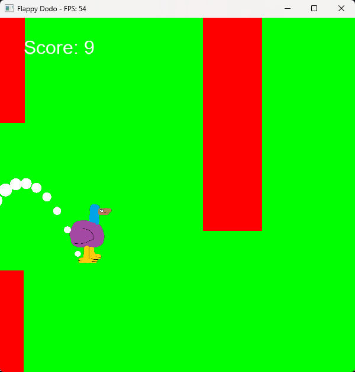
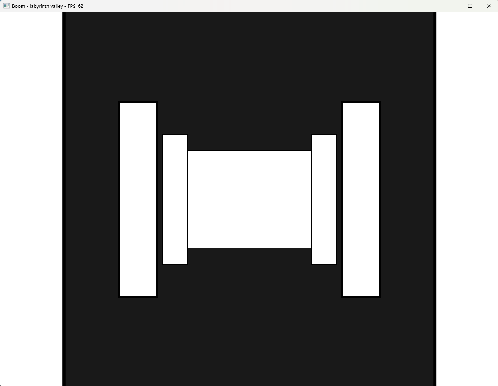
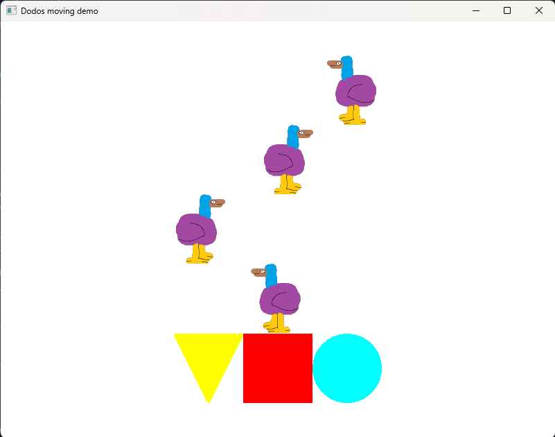
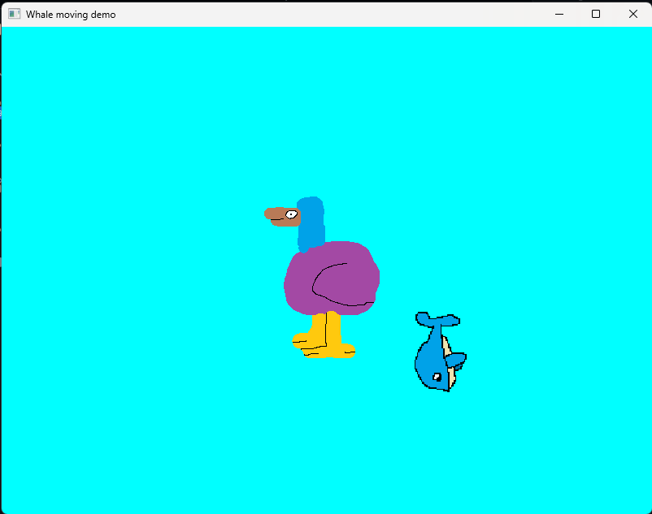
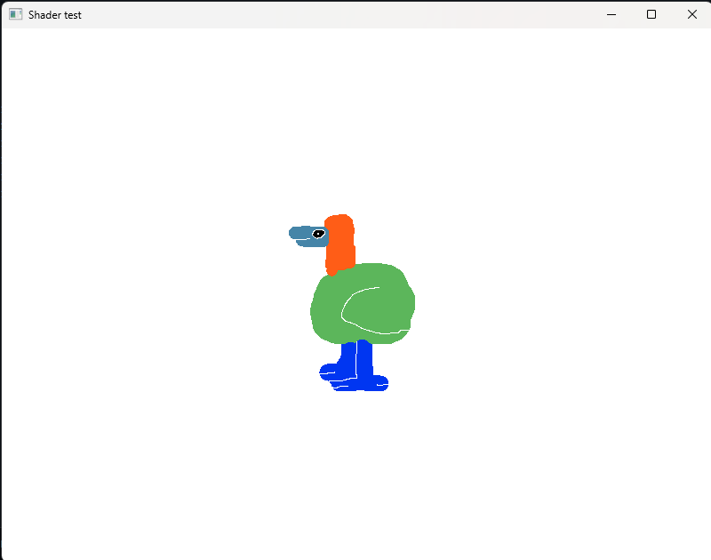
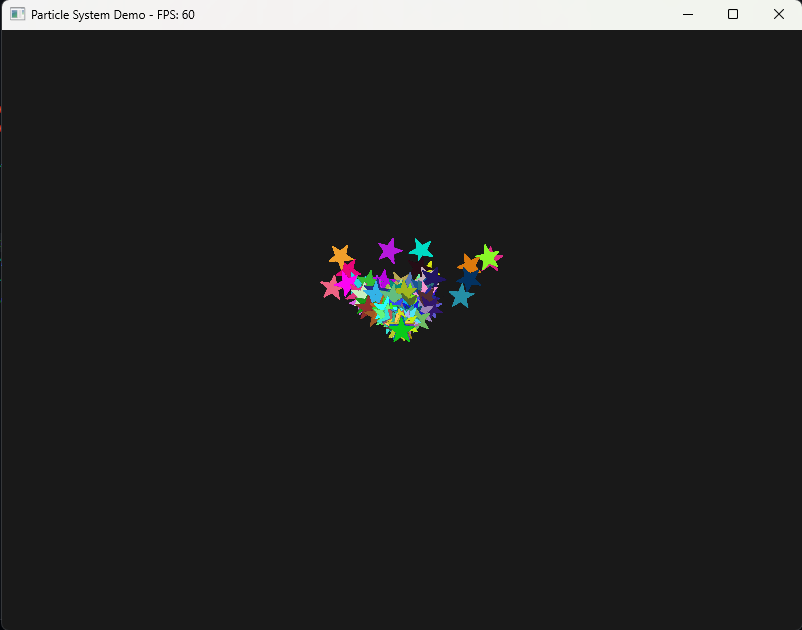
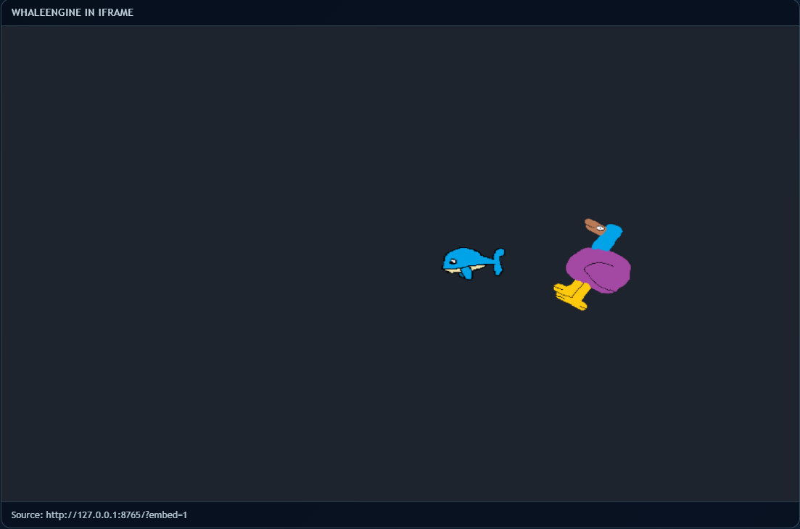
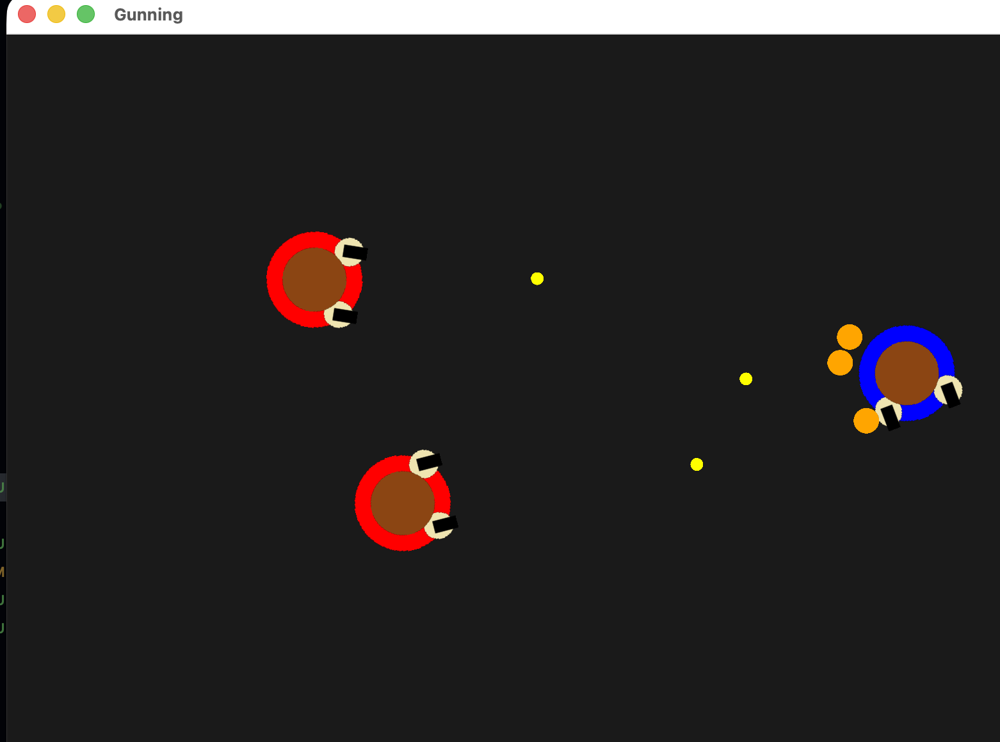
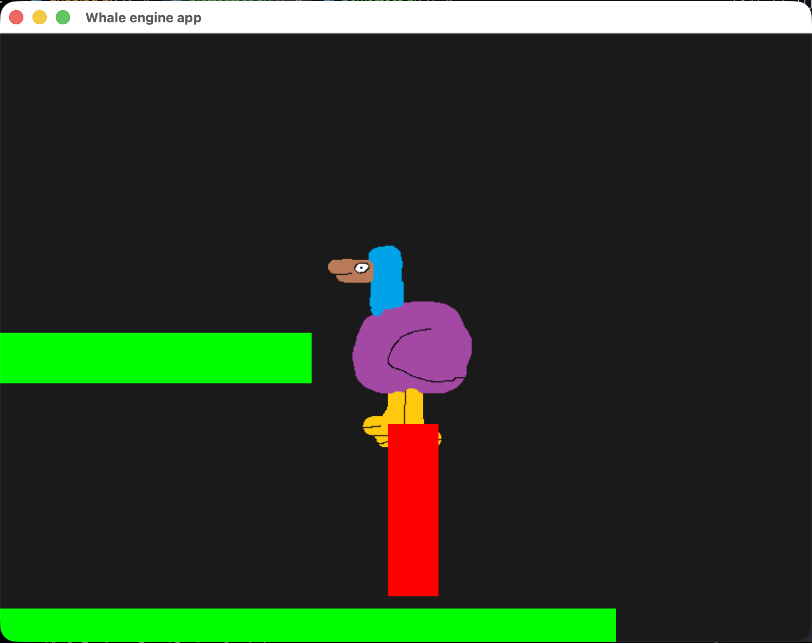
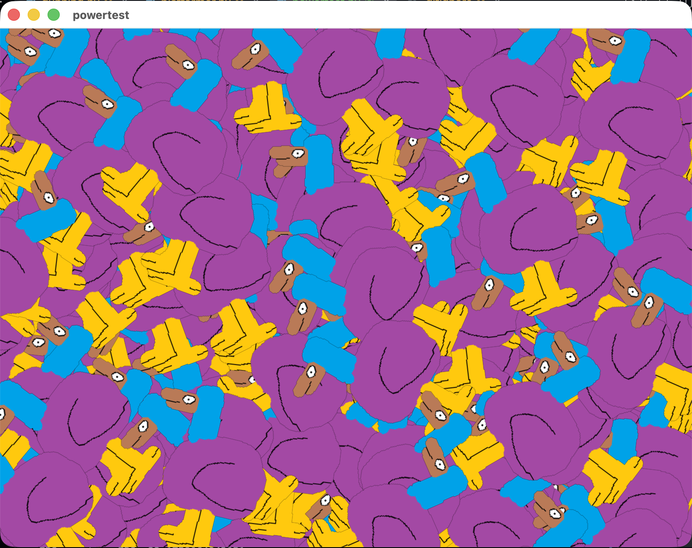